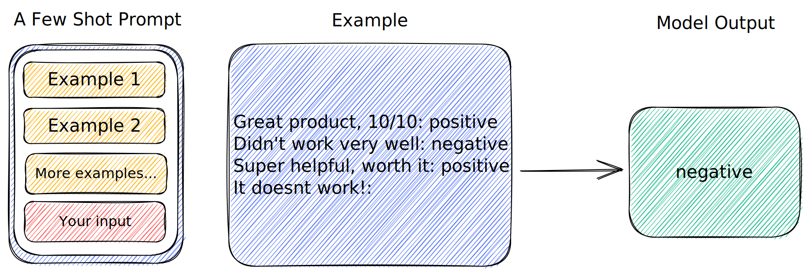

# 🟢 多范例提示

{ width="100%" }


另一个提示策略是 *多范例提示* [^1] [^2], 这种策略将为模型展示一些例子（shots）,从而更形象地描述你的需求。 

在上图的例子中, 我们尝试对用户反馈进行正面(positive)或反面(negative)的分类。 我们向模型展示了3个例子，然后我们输入一个不在例子里面的反馈 (`It doesnt work!:`)。模型发现头三个例子都被分类到 `positive` 或者 `negative`, 进而通过这些信息将我们最后输入的反馈分类到了 `negative`.

我们如何结构化地设计例子也是非常重要的。由于我们已经将头三个例子结构化成：`input: classification`, 因此模型最终也跟着同样只输出分类的结果，而不是一段完整的句子，例如 `this review is positive`. 

<iframe
    src="https://embed.learnprompting.org/embed?config=eyJ0b3BQIjowLCJ0ZW1wZXJhdHVyZSI6MCwibWF4VG9rZW5zIjoyNTYsIm91dHB1dCI6Im5lZ2F0aXZlIiwicHJvbXB0IjoiR3JlYXQgcHJvZHVjdCwgMTAvMTA6IHBvc2l0aXZlXG5EaWRuJ3Qgd29yayB2ZXJ5IHdlbGw6IG5lZ2F0aXZlXG5TdXBlciBoZWxwZnVsLCB3b3J0aCBpdDogcG9zaXRpdmVcbkl0IGRvZXNudCB3b3JrIToiLCJtb2RlbCI6InRleHQtZGF2aW5jaS0wMDMifQ%3D%3D"
    style={{width:"100%", height:"350px", border:"0", borderRadius:"4px", overflow:"hidden"}}
    sandbox="allow-forms allow-modals allow-popups allow-presentation allow-same-origin allow-scripts"
></iframe>

<br/>

!!! 备注
    每一个输入-输出对被称为一个 *范例*.

## 结构化的延伸

多范例提示的一个关键场景是当我们需要以 **特定的结构** 输出结果，但是又很难向模型进行描述的时候。为了理解这一点，让我们看这样一个例子：假设您需要通过分析当地的报纸文章来汇编附近城镇公民的姓名和职业。 您希望模型读取每篇文章并以 `First Last [OCCUPATION]` 格式输出姓名和职业列表. 未来让模型做到这一点，您可以向它展示一些示例:

<iframe
    src="https://embed.learnprompting.org/embed?config=eyJ0b3BQIjowLCJ0ZW1wZXJhdHVyZSI6MCwibWF4VG9rZW5zIjoyNTYsIm91dHB1dCI6IjEuIExhdXJhIFNpbW1vbnMgW0ZBUk1FUl1cbjIuIEtldmluIEFsdmFyZXogW0RBTkNFIElOU1RSVUNUT1JdXG4zLiBSYWNoZWwgTydDb25ub3IgW1ZPTFVOVEVFUl0iLCJwcm9tcHQiOiJJbiB0aGUgYnVzdGxpbmcgdG93biBvZiBFbWVyYWxkIEhpbGxzLCBhIGRpdmVyc2UgZ3JvdXAgb2YgaW5kaXZpZHVhbHMgbWFkZSB0aGVpciBtYXJrLiBTYXJhaCBNYXJ0aW5leiwgYSBkZWRpY2F0ZWQgbnVyc2UsIHdhcyBrbm93biBmb3IgaGVyIGNvbXBhc3Npb25hdGUgY2FyZSBhdCB0aGUgbG9jYWwgaG9zcGl0YWwuIERhdmlkIFRob21wc29uLCBhbiBpbm5vdmF0aXZlIHNvZnR3YXJlIGVuZ2luZWVyLCB3b3JrZWQgdGlyZWxlc3NseSBvbiBncm91bmRicmVha2luZyBwcm9qZWN0cyB0aGF0IHdvdWxkIHJldm9sdXRpb25pemUgdGhlIHRlY2ggaW5kdXN0cnkuIE1lYW53aGlsZSwgRW1pbHkgTmFrYW11cmEsIGEgdGFsZW50ZWQgYXJ0aXN0IGFuZCBtdXJhbGlzdCwgcGFpbnRlZCB2aWJyYW50IGFuZCB0aG91Z2h0LXByb3Zva2luZyBwaWVjZXMgdGhhdCBhZG9ybmVkIHRoZSB3YWxscyBvZiBidWlsZGluZ3MgYW5kIGdhbGxlcmllcyBhbGlrZS4gTGFzdGx5LCBNaWNoYWVsIE8nQ29ubmVsbCwgYW4gYW1iaXRpb3VzIGVudHJlcHJlbmV1ciwgb3BlbmVkIGEgdW5pcXVlLCBlY28tZnJpZW5kbHkgY2FmZSB0aGF0IHF1aWNrbHkgYmVjYW1lIHRoZSB0b3duJ3MgZmF2b3JpdGUgbWVldGluZyBzcG90LiBFYWNoIG9mIHRoZXNlIGluZGl2aWR1YWxzIGNvbnRyaWJ1dGVkIHRvIHRoZSByaWNoIHRhcGVzdHJ5IG9mIHRoZSBFbWVyYWxkIEhpbGxzIGNvbW11bml0eS5cbjEuIFNhcmFoIE1hcnRpbmV6IFtOVVJTRV1cbjIuIERhdmlkIFRob21wc29uIFtTT0ZUV0FSRSBFTkdJTkVFUl1cbjMuIEVtaWx5IE5ha2FtdXJhIFtBUlRJU1RdXG40LiBNaWNoYWVsIE8nQ29ubmVsbCBbRU5UUkVQUkVORVVSXVxuXG5BdCB0aGUgaGVhcnQgb2YgdGhlIHRvd24sIENoZWYgT2xpdmVyIEhhbWlsdG9uIGhhcyB0cmFuc2Zvcm1lZCB0aGUgY3VsaW5hcnkgc2NlbmUgd2l0aCBoaXMgZmFybS10by10YWJsZSByZXN0YXVyYW50LCBHcmVlbiBQbGF0ZS4gT2xpdmVyJ3MgZGVkaWNhdGlvbiB0byBzb3VyY2luZyBsb2NhbCwgb3JnYW5pYyBpbmdyZWRpZW50cyBoYXMgZWFybmVkIHRoZSBlc3RhYmxpc2htZW50IHJhdmUgcmV2aWV3cyBmcm9tIGZvb2QgY3JpdGljcyBhbmQgbG9jYWxzIGFsaWtlLlxuXG5KdXN0IGRvd24gdGhlIHN0cmVldCwgeW91J2xsIGZpbmQgdGhlIFJpdmVyc2lkZSBHcm92ZSBMaWJyYXJ5LCB3aGVyZSBoZWFkIGxpYnJhcmlhbiBFbGl6YWJldGggQ2hlbiBoYXMgd29ya2VkIGRpbGlnZW50bHkgdG8gY3JlYXRlIGEgd2VsY29taW5nIGFuZCBpbmNsdXNpdmUgc3BhY2UgZm9yIGFsbC4gSGVyIGVmZm9ydHMgdG8gZXhwYW5kIHRoZSBsaWJyYXJ5J3Mgb2ZmZXJpbmdzIGFuZCBlc3RhYmxpc2ggcmVhZGluZyBwcm9ncmFtcyBmb3IgY2hpbGRyZW4gaGF2ZSBoYWQgYSBzaWduaWZpY2FudCBpbXBhY3Qgb24gdGhlIHRvd24ncyBsaXRlcmFjeSByYXRlcy5cblxuQXMgeW91IHN0cm9sbCB0aHJvdWdoIHRoZSBjaGFybWluZyB0b3duIHNxdWFyZSwgeW91J2xsIGJlIGNhcHRpdmF0ZWQgYnkgdGhlIGJlYXV0aWZ1bCBtdXJhbHMgYWRvcm5pbmcgdGhlIHdhbGxzLiBUaGVzZSBtYXN0ZXJwaWVjZXMgYXJlIHRoZSB3b3JrIG9mIHJlbm93bmVkIGFydGlzdCwgSXNhYmVsbGEgVG9ycmVzLCB3aG9zZSB0YWxlbnQgZm9yIGNhcHR1cmluZyB0aGUgZXNzZW5jZSBvZiBSaXZlcnNpZGUgR3JvdmUgaGFzIGJyb3VnaHQgdGhlIHRvd24gdG8gbGlmZS5cblxuUml2ZXJzaWRlIEdyb3ZlJ3MgYXRobGV0aWMgYWNoaWV2ZW1lbnRzIGFyZSBhbHNvIHdvcnRoIG5vdGluZywgdGhhbmtzIHRvIGZvcm1lciBPbHltcGljIHN3aW1tZXItdHVybmVkLWNvYWNoLCBNYXJjdXMgSmVua2lucy4gTWFyY3VzIGhhcyB1c2VkIGhpcyBleHBlcmllbmNlIGFuZCBwYXNzaW9uIHRvIHRyYWluIHRoZSB0b3duJ3MgeW91dGgsIGxlYWRpbmcgdGhlIFJpdmVyc2lkZSBHcm92ZSBTd2ltIFRlYW0gdG8gc2V2ZXJhbCByZWdpb25hbCBjaGFtcGlvbnNoaXBzLlxuMS4gT2xpdmVyIEhhbWlsdG9uIFtDSEVGXVxuMi4gRWxpemFiZXRoIENoZW4gW0xJQlJBUklBTl1cbjMuIElzYWJlbGxhIFRvcnJlcyBbQVJUSVNUXVxuNC4gTWFyY3VzIEplbmtpbnMgW0NPQUNIXVxuXG5PYWsgVmFsbGV5LCBhIGNoYXJtaW5nIHNtYWxsIHRvd24sIGlzIGhvbWUgdG8gYSByZW1hcmthYmxlIHRyaW8gb2YgaW5kaXZpZHVhbHMgd2hvc2Ugc2tpbGxzIGFuZCBkZWRpY2F0aW9uIGhhdmUgbGVmdCBhIGxhc3RpbmcgaW1wYWN0IG9uIHRoZSBjb21tdW5pdHkuXG5cbkF0IHRoZSB0b3duJ3MgYnVzdGxpbmcgZmFybWVyJ3MgbWFya2V0LCB5b3UnbGwgZmluZCBMYXVyYSBTaW1tb25zLCBhIHBhc3Npb25hdGUgb3JnYW5pYyBmYXJtZXIga25vd24gZm9yIGhlciBkZWxpY2lvdXMgYW5kIHN1c3RhaW5hYmx5IGdyb3duIHByb2R1Y2UuIEhlciBkZWRpY2F0aW9uIHRvIHByb21vdGluZyBoZWFsdGh5IGVhdGluZyBoYXMgaW5zcGlyZWQgdGhlIHRvd24gdG8gZW1icmFjZSBhIG1vcmUgZWNvLWNvbnNjaW91cyBsaWZlc3R5bGUuXG5cbkluIE9hayBWYWxsZXkncyBjb21tdW5pdHkgY2VudGVyLCBLZXZpbiBBbHZhcmV6LCBhIHNraWxsZWQgZGFuY2UgaW5zdHJ1Y3RvciwgaGFzIGJyb3VnaHQgdGhlIGpveSBvZiBtb3ZlbWVudCB0byBwZW9wbGUgb2YgYWxsIGFnZXMuIEhpcyBpbmNsdXNpdmUgZGFuY2UgY2xhc3NlcyBoYXZlIGZvc3RlcmVkIGEgc2Vuc2Ugb2YgdW5pdHkgYW5kIHNlbGYtZXhwcmVzc2lvbiBhbW9uZyByZXNpZGVudHMsIGVucmljaGluZyB0aGUgbG9jYWwgYXJ0cyBzY2VuZS5cblxuTGFzdGx5LCBSYWNoZWwgTydDb25ub3IsIGEgdGlyZWxlc3Mgdm9sdW50ZWVyLCBkZWRpY2F0ZXMgaGVyIHRpbWUgdG8gdmFyaW91cyBjaGFyaXRhYmxlIGluaXRpYXRpdmVzLiBIZXIgY29tbWl0bWVudCB0byBpbXByb3ZpbmcgdGhlIGxpdmVzIG9mIG90aGVycyBoYXMgYmVlbiBpbnN0cnVtZW50YWwgaW4gY3JlYXRpbmcgYSBzdHJvbmcgc2Vuc2Ugb2YgY29tbXVuaXR5IHdpdGhpbiBPYWsgVmFsbGV5LlxuXG5UaHJvdWdoIHRoZWlyIHVuaXF1ZSB0YWxlbnRzIGFuZCB1bndhdmVyaW5nIGRlZGljYXRpb24sIExhdXJhLCBLZXZpbiwgYW5kIFJhY2hlbCBoYXZlIHdvdmVuIHRoZW1zZWx2ZXMgaW50byB0aGUgZmFicmljIG9mIE9hayBWYWxsZXksIGhlbHBpbmcgdG8gY3JlYXRlIGEgdmlicmFudCBhbmQgdGhyaXZpbmcgc21hbGwgdG93bi4iLCJtb2RlbCI6InRleHQtZGF2aW5jaS0wMDMifQ%3D%3D"
    style={{width:"100%", height:"500px", border:"0", borderRadius:"4px", overflow:"hidden"}}
    sandbox="allow-forms allow-modals allow-popups allow-presentation allow-same-origin allow-scripts"
></iframe>

通过向模型展示正确的输出格式示例，它就能够为新的文章生成正确的输出结果。.

:::note
    尽管我们可以通过使用指令提示符的方式来生成相同的输出，但多范例提示在输出结果的 *一致性* 上会更好。 

## 不同类型的范例提示

单词 "shot" 在该场景下与 "example（范例）"一致. 除了多范例提示 (few-shot prompting)提示之外, 还有另外两种不同的类型。它们之间唯一的区别就是你向模型展示了多少范例。

类型:
- 无范例提示（0 shot prompting）: 不展示范例
- 单范例提示（1 shot prompting）: 只展示1条范例
- 多范例提示（few shot prompting）: 展示2条及以上的范例

### 无范例提示

无范例提示是最基本的提示形式。它仅仅是向模型展示提示信息，没有提供任何示例，并要求其生成回答。因此，你到目前为止看到的所有指令和角色提示都属于无范例提示。无范例提示的另一个例子是:

```text
Add 2+2:
```

这是无范例提示，因为我们没有向模型展示任何完整的示例。

### 单范例提示

单范例提示是向模型展示一个示例。例如：

```text
Add 3+3: 6
Add 2+2:
```

我们仅向模型展示了一个完整的示例 (`Add 3+3: 6`), 因此这是一个单范例提示。

### 多范例提示

多范例提示是向模型展示2个或更多示例。例如:

```text
Add 3+3: 6
Add 5+5: 10
Add 2+2:
```

这是我们向模型展示了至少2个完整的示例 (`Add 3+3: 6` and `Add 5+5: 10`). 通常，展示给模型的示例越多，输出结果就越好，因此在大多数情况下，多范例提示比另外两种提示更受欢迎。

## 结论

多范例提示是让模型生成准确且格式正确的输出的强大技术!

[^1] Logan IV, R., Balazevic, I., Wallace, E., Petroni, F., Singh, S., & Riedel, S. (2022). Cutting Down on Prompts and Parameters: Simple Few-Shot Learning with Language Models. Findings of the Association for Computational Linguistics: ACL 2022, 2824–2835. https://doi.org/10.18653/v1/2022.findings-acl.222

[^2] Lake, B. M., Salakhutdinov, R., & Tenenbaum, J. B. (2015). Human-level concept learning through probabilistic program induction. Science, 350(6266), 1332–1338.

 