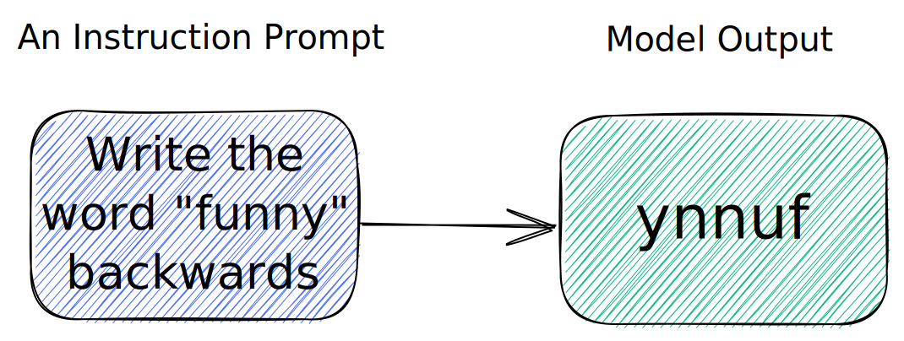

# 🟢 给出指令

{ width="100%" }


最简单的提示方法之一就是直接给出指令（有时称为 *指令提示* ）[^1] [^2]。我们上一个部分中就已经看到了一个简单的指令(`1,000,000 * 9,000等于几? 请确保输入正确数量的零，即使数量很多也要如此:`)。然而，现代人工智能可以遵循更复杂的指令。

以下是一个交互式嵌入示例 [embed](https://learnprompting.org/docs/basics/intro#embeds). 如果您看不到它，请确保在您的浏览器中打开了JavaScript。由于这是一个交互式演示，你可以编辑文本并单击 `Generate` 按钮重新运行人工智能。

#### 示例1

<iframe
    src="https://embed.learnprompting.org/embed?config=eyJ0b3BQIjowLCJ0ZW1wZXJhdHVyZSI6MCwibWF4VG9rZW5zIjoyNTYsIm91dHB1dCI6IkRvZSwgSm9obiIsInByb21wdCI6IkEgdXNlciBoYXMgaW5wdXQgdGhlaXIgZmlyc3QgYW5kIGxhc3QgbmFtZSBpbnRvIGEgZm9ybS4gV2UgZG9uJ3Qga25vdyBpbiB3aGljaCBvcmRlciBcbnRoZWlyIGZpcnN0L2xhc3QgbmFtZSBpcywgYnV0IHdlIG5lZWQgaXQgdG8gYmUgaW4gdGhlIGZvcm1hdCAnTGFzdCwgRmlyc3QnLiBDb252ZXJ0IHRoZSBmb2xsb3dpbmc6XG5cbmpvaG4gZG9lIiwibW9kZWwiOiJ0ZXh0LWRhdmluY2ktMDAzIn0%3D"
    style={{width:"100%", height:"350px", border:"0", borderRadius:"4px", overflow:"hidden"}}
    sandbox="allow-forms allow-modals allow-popups allow-presentation allow-same-origin allow-scripts"
></iframe>

<br/>AI能够轻松地解决这个问题。使用指令提示，它可以解决许多其它简单和更复杂地问题。

#### 示例2

这是一个更复杂地例子[^A]:

```
请阅读以下销售邮件。删除任何可用于识别个人身份的信息 (PII)，并用相应的占位符替换它。例如，用"[姓名]"替换"John Doe"。

你好 John，

我写信给你是因为我注意到你最近买了一辆新车。我是一家当地经销商 (Cheap Dealz) 的销售员，我想让你知道我们有一辆新车的超值优惠。如果你有兴趣，请告诉我。

谢谢，

Jimmy Smith

电话：410-805-2345
电子邮件：jimmysmith@cheapdealz.com
```

以下是 [AI的回答](https://beta.openai.com/playground/p/002o3gmji5jlwUfRq9d7KDHc?model=text-davinci-003):

```text
// highlight-start
你好 [姓名]，

我写信给你是因为我注意到你最近买了一辆新车。我是一家当地经销商 ([经销商名称]) 的销售员，我想让你知道我们有一辆新车的超值优惠。如果你有兴趣，请告诉我。

谢谢，

[销售员姓名]

电话：[电话号码]
电子邮件：[电子邮件地址]
// highlight-end
```

I看到模型如何从指令中推断出结果真的很酷。例如，它知道将 `Cheap Dealz` 替换为 `[经销商名称]`，将 `Jimmy Smith` 替换为 `[销售员姓名]`, 即使我们没有明确告诉它这样做。

[^1]: Efrat, A., & Levy, O. (2020). The Turking Test: Can Language Models Understand Instructions?
[^2]: Mishra, S., Khashabi, D., Baral, C., Choi, Y., & Hajishirzi, H. (2022). Reframing Instructional Prompts to GPTk’s Language. Findings of the Association for Computational Linguistics: ACL 2022. https://doi.org/10.18653/v1/2022.findings-acl.50
[^A]: Allowing AI to remove PII from text is a promising approach, but it should be used with extraordinary caution as it may make mistakes.

