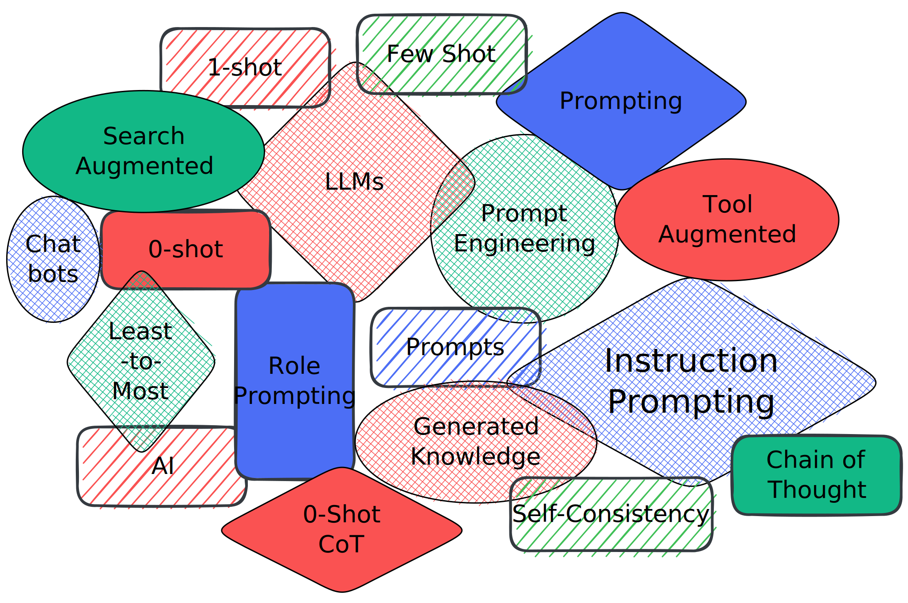
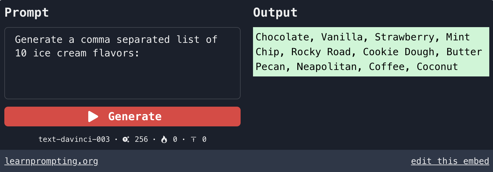
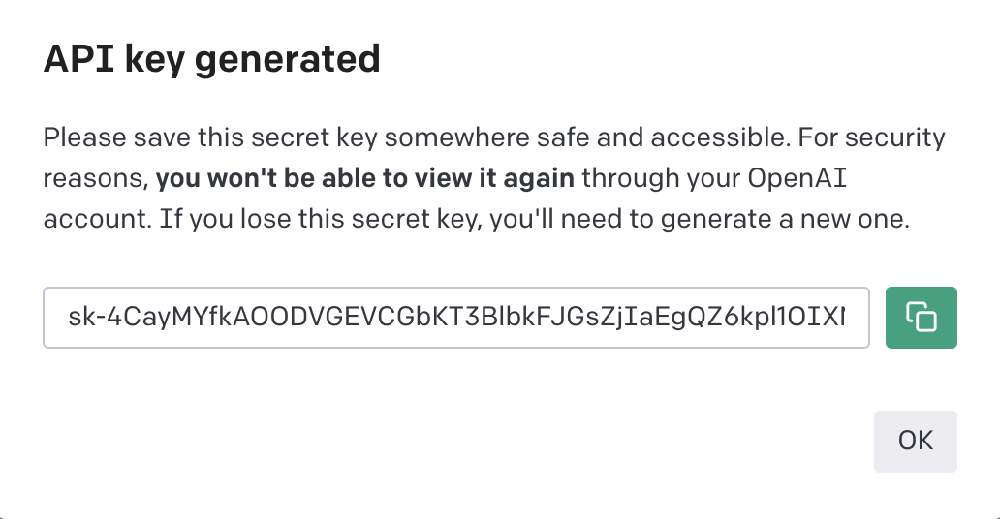

# 🟢 简介

{ width="70%" }


本章介绍简单的提示技术和术语。为了理解提示语/提示工程，您首先需要了解一些 *非常* 基本的AI概念。如果您已经了解以下主题，可以跳到 [下一篇文章](https://learnprompting.org/docs/basics/prompting).

## 什么是人工智能?

从目的的角度出发, 人工智能（AI）是人们创造的一些“聪明的”算法，使得机器能够像人类一样“思考”[^1]。这些算法可以写 **论文**、解决 **数学问题**、 并创造 **艺术**. 该领域的最新进展已经十分先进，以至于人工智能可以写出令人信服的 **销售邮件**、 **新闻报道**, 甚至可以 **赢得 [艺术比赛](https://impakter.com/art-made-by-ai-wins-fine-arts-competition/)**。

目前，人工智能正在颠覆许多行业，包括 **新闻行业**, **医疗卫生行业** 和 **education**。 你可能很快看到人工智能在你工作或教学中出现，即使现在还没有. 但是，尽管人工智能非常有用，但它们需要人类来指导它们做什么。通常情况下，人工智能就像非常聪明的五岁小孩。它们可以做很多事情，但它们需要仔细的指导才能做得好。

能够正确指导人工智能是一项非常强大的技能，那么该如何跟它们沟通呢? 本课程讨论的人工智能能够理解英语（和其他语言）,所以我们通常只需描述我们想要完成的任务，例如，我们可以告诉人工智能 `写一篇关于人工智能的优点的文章` ，它的回答如下[^2]:

```
近年来，人工智能（AI）已经成为科技界的一个热门话题。 随着技术的不断发展，人工智能可能彻底改变我们生活的许多方面，人工智能也正变得越来越重要。从医疗保健和交通，到教育和制造，人工智能已经向我们展示了它在多个方面造福社会的巨大潜力。

人工智能最明显的好处是它能够将繁琐的任务自动化。人工智能系统可用于自动化大规模操作，如数据分析、客服，甚至商品生产。这样便释放了人类的劳动力，让人们可以专注于需要更多人类智慧的复杂的和创造性的任务。人工智能也可用于分析大量数据，其所花时间远低于人类。这在金融等行业可能十分有用，人工智能可以检测股票市场的模式，并提供可能被忽视的见解。

人工智能还可以用于预测，并提高效率和准确性。例如，人工智能可以预测客户的趋势和偏好，帮助企业做出更好的决策并增加利润。 人工智能还可以识别金融、医疗保健和制造等行业的潜在风险与机会。这可以帮企业做出明智的决定，并减少昂贵的错误和风险。

最后，人工智能可以被用来提高我们对世界的理解。人工智能可用于分析大型数据集，并让我们更好地了解周围地世界。这可以帮助我们更好地了解气候变化的影响、帮助我们找到新的疾病治疗方法，甚至预测地震和洪水等灾难。

总之，人工智能有可能彻底改变我们生活的许多方面。从自动化繁琐的任务到洞察和预测，人工智能可以用来提高效率、准确性和我们对世界的理解。随着技术的不断发展，人工将变得越来越有意义，其造福社会的潜力也会越来越大。
```

## 我需要关心人工智能吗?

人工智能可以用来自动完成你 *现在* 正花费无数时间做的任务。我们在上面提到了几个例子，但你也可以考虑任何稍微重复的任务。这些任务包括写电子邮件，写报告，甚至是写代码。如果你向人工智能描述这项任务，它就有可能为你做这件事，或者至少给你一个开头。

## 我该如何开始?

阅读本章的其余部分，然后查看你感兴趣的其他章节。 如果你特别想了解专业人士如何使用人工智能来实现自动化，那么 [应用提示](https://learnprompting.org/docs/applied_prompting/overview)部分是你所感兴趣的。你可以用一些人工智能网站，例如 [Playground](https://beta.openai.com/playground), [other IDEs](https://learnprompting.org/docs/tooling/IDEs/intro), 或者通过这个网站 [embeds](https://learnprompting.org/docs/basics/intro#embeds) 使用简单的交互。

在阅读下一章之前，需要提醒一下：你无需任何技术背景便可以开始学习提示工程，在犯错中学习。

### 嵌入

本课程提供交互式学习体验。你可以使用这个嵌入式站点 [embeds](https://embed.learnprompting.org/) 来试验课程中讨论的练习。

下面是嵌入式站点 **截图** :

{ width="70%" }

你应该能够看到此段下方与此截图完全相同的嵌入站点。如果不能看到，则可能需要启用JavaScript或使用其它浏览器。

<hr/>
嵌入式站点:
<iframe
    src="https://embed.learnprompting.org/embed?config=eyJ0b3BQIjowLCJ0ZW1wZXJhdHVyZSI6MCwibWF4VG9rZW5zIjoyNTYsIm91dHB1dCI6IkNob2NvbGF0ZSwgVmFuaWxsYSwgU3RyYXdiZXJyeSwgTWludCBDaGlwLCBSb2NreSBSb2FkLCBDb29raWUgRG91Z2gsIEJ1dHRlciBQZWNhbiwgTmVhcG9saXRhbiwgQ29mZmVlLCBDb2NvbnV0IiwicHJvbXB0IjoiR2VuZXJhdGUgYSBjb21tYSBzZXBhcmF0ZWQgbGlzdCBvZiAxMCBpY2UgY3JlYW0gZmxhdm9yczoiLCJtb2RlbCI6InRleHQtZGF2aW5jaS0wMDMifQ%3D%3D"
    style={{width:"100%", height:"280px", border:"0", borderRadius:"4px", overflow:"hidden"}}
    sandbox="allow-forms allow-modals allow-popups allow-presentation allow-same-origin allow-scripts"
></iframe>
<hr/>

假设你可以看到它，请单击 **生成** 按钮. 如果这是你第一次使用它（或者你在新的浏览器中，又或者清除了cookie）它将要求你输入 [OpenAI API 密钥](https://platform.openai.com/account/api-keys). 你可以通过单击 [此链接](https://platform.openai.com/account/api-keys) 并注册OpenAI账户来获取免费密钥。此密钥运行你使用OpenAI的API在嵌入中生成文本。

!!! 注意
    尽管OpenAI提供免费积分，但你最终必须付费才能使用他们的AI。幸运的是它 [相对便宜](https://openai.com/pricing)!


当你导航到 [OpenAI API 密钥](https://platform.openai.com/account/api-keys) 页面时, 单击 **创建新密钥** 按钮. 它将弹出一个包含如下文本字符串的窗口:

{ width="70%" }


将此密码放入嵌入式站点中并点击 **保存**。你就可以在这个站点里面体验chatGPT了。

现在，你已经掌握了入门所需的所有信息，祝你快乐学习!


[^1]: 从技术上讲，它们不像人类那样“思考”， 但这是一种简单的解释方式。
[^2]: 一个人工智能（GPT-3 davinci-003）确实写了这个。
