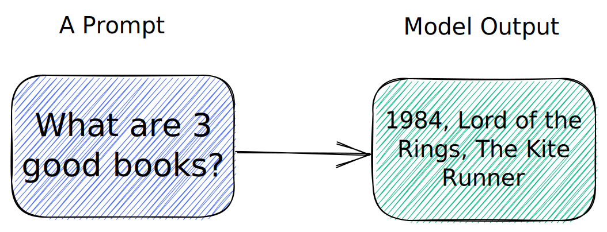

# 🟢 提示过程

{ width="100%" }


在上一章中，我们讨论了人工智能以及人类如何指导AI执行任务。指导人工智能执行任务的过程称为提示过程[^1]。我们向AI提供一组指令（提示），然后它执行任务。提示可以简单到一个问题，也可复杂到多个段落。

以下是两个提示的示例:

#### 1) 文章摘要

假设您正在阅读一篇关于佛罗里达州降雪的文章。您想快速了解文章的主要内容，因此您向AI展示您正在阅读的内容，并要求进行摘要[^2]:

```
佛罗里达州很少下雪，特别是在中部和南部地区。除了州的极北部地区外，佛罗里达州大部分主要城市都没有记录到可测量的降雪量，尽管记录到了少量的痕迹，或者每个世纪观测到几次空气中的飘雪。根据国家气象局的数据，在佛罗里达群岛和基韦斯特群岛自欧洲殖民以来没有发生过飘雪的情况，已有超过300年时间。在迈阿密、劳德代尔堡和棕榈滩，超过200年中只有一次关于在空气中观察到飘雪的报告，发生在1977年1月。在任何情况下，自这次1977年的事件以来，迈阿密、劳德代尔堡和棕榈滩都没有看到过飘雪的情况。

```

以下是 AI 的回复。更简洁易读！!

```text
// highlight-start
佛罗里达州很少下雪，除了州的极北部地区外，在过去的200年中迈阿密、劳德代尔堡和棕榈滩
这些主要城市中只有一次观察到空气中飘雪的报告。
// highlight-end
```

#### 2) 数学问题求解

如果您有一个数学方程，想让语言模型来解决，您可以通过提问 "数学方程等于几" 来输入提示。

对于一个给定的问题，您的完整提示可能是这样的：

```
965 * 590 等于几?
```

对于这个提示，GPT-3（text-davinci-003）（一种 AI 模型）有时会回答 569,050（不正确）。这就是 **提示工程** 的重要性所在。

# 提示工程

如果我们不是问 `965 * 590 等于几？`, 而是问 
`确保你的答案完全正确。965*590 等于几？确保你的答案完全正确：`, GPT-3 将会回答 `569350` (正确). 为什么会这样呢？为什么要两次告诉 AI 对于正确答案有帮助？我们如何能在我们的任务中产生最佳结果的提示？尤其是最后一个问题，是 **提示工程** 领域以及本课程的重点。 请继续阅读，了解如何设计好的提示！

!!! 提示
    还有一件事，如果你在GPT-3上运行上述提示，你应该将 TEMPERATURE 设置为 0 来消除随机性。 


继续阅读以了解如何设计好的提示!

[^1]: Shin, T., Razeghi, Y., Logan IV, R. L., Wallace, E., & Singh, S. (2020). AutoPrompt: Eliciting Knowledge from Language Models with Automatically Generated Prompts. Proceedings of the 2020 Conference on Empirical Methods in Natural Language Processing (EMNLP). https://doi.org/10.18653/v1/2020.emnlp-main.346

[^2]: This paragraph is from https://en.wikipedia.org/wiki/Snow_in_Florida
