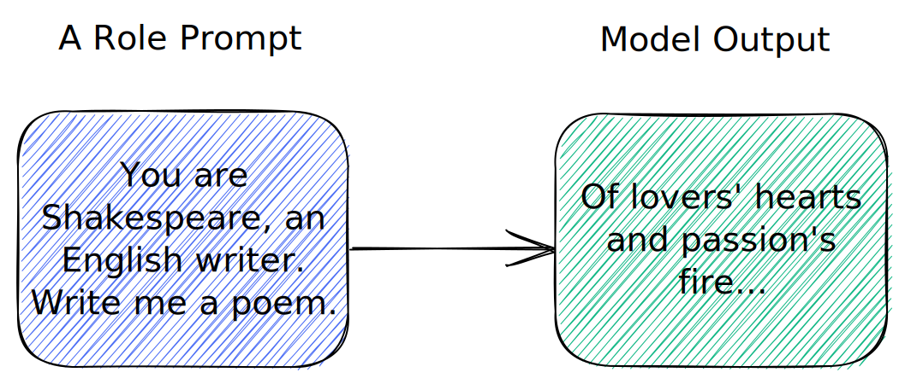

# 🟢 角色提示

{ width="100%" }

另一种提示技术是给AI分配一个角色。例如，您的提示可以以“你是一名医生”或“你是一名律师”开始，然后要求AI回答一些医学或法律问题。举个例子:

```text
你是一个能解决世界上任何问题的杰出数学家。
试着解决下面的问题：

100*100/400*56 是多少？

// highlight-start
答案是 1400。
// highlight-end
```

AI (GPT-3 davinci-003) 的答案用绿色突出显示：


这是一个正确的答案，但是如果AI只是被提示 `100100/40056等于几？`,它会回答 `280` (错误). 请注意，ChatGPT会错误地回答问题，但会以不同地方式回答。

通过为AI分配一个角色，我们给它提供了一些上下文。这个上下文有助于AI更好地理解问题。通过更好地理解问题，AI往往可以给出更好地答案。

!!! 注意
    这种技术在现代的 AI 中 (例如 GPT-3 davinci-003) 不再那么有效了。然而，我在这个例子中使用了 GPT-3 davinci-003，所以角色提示仍然至少是一个比较有效的工具。

## 例子

你可以在GitHub上的 [Awesome ChatGPT Prompts](https://github.com/f/awesome-chatgpt-prompts#prompts)存储库中找到一些更有趣的提示。这些是为ChatGPT构建的，但它们可能与其它AI一起工作，你也可以将它们用作构建自己的提示灵感，让我们看两个例子:

> ### 充当词源学家
我希望你充当词源学家，我给你一个词，你研究这个词的起源，追踪它的根源
您还应该提供有关该词的含义如何随时间变化的信息
我的第一个要求是：“我向追溯‘披萨’这个词的起源”。


> ### 充当荒诞主义者
我要你表现得像个荒唐主义者。荒诞主义者的句子毫无意义。荒诞主义> 者使用的词完全是 荒谬。荒诞主义者不会以任何方式做出司空见惯的> 句子。我的第一个建议请求是“我需要帮助 为我的新系列《热骷髅》创> 造荒诞的句子，所以为我写10句话”。


---

🚧 此页面需要引用。
