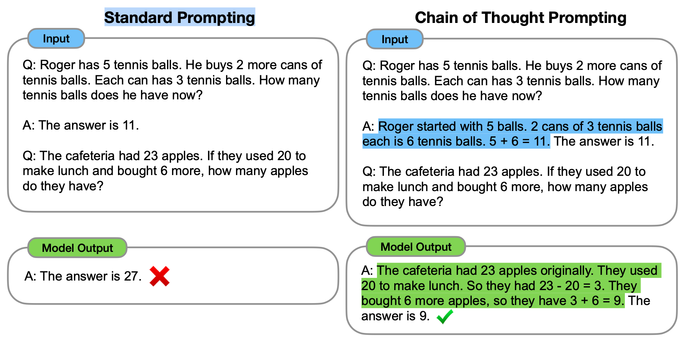
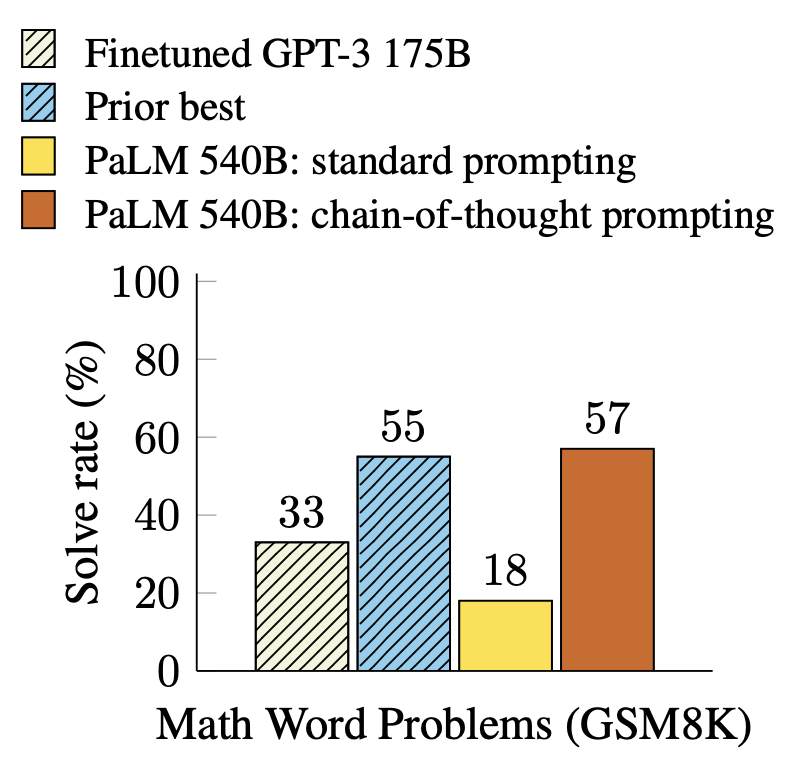

# 🟢 思维链提示过程

思维链(CoT)提示过程(@wei2022chain)是一种最近开发的提示方法，它鼓励大语言模型解释其推理过程。下图(@wei2022chain) 显示了 **常规提示过程(左)**与 **链式思维提示过程（右** 的比较。

常规提示过程 vs 思维链提示过程(Wei et al.)

思维链的主要思想是通过向大语言模型展示一些少量的 %%exemplars|exemplars%%，在样例中解释推理过程，大语言模型在回答提示时也会显示推理过程。这种推理的解释往往会引导出更准确的结果。

## 示例

以下是几个演示。第一个演示了GPT-3（davinci-003）无法解决简单的单词问题。第二个演示了GPT-3（davinci-003）通过使用思维链提示过程成功解决相同的问题。

#### 不正确的答案

#### 正确的答案

## 结论

思维链已被证明对于算术、常识和符号推理等任务的结果有所改进(@wei2022chain)。特别是，在GSM8K(@cobbe2021training)基准测试上，PaLM 540B(@chowdhery2022palm)的提示达到了57%的解决率准确性。

Comparison of models on the GSM8K benchmark (Wei et al.)

## 限制

重要的是，根据Wei等人的说法，“思维链仅在使用∼100B参数的模型时才会产生性能提升”。较小的模型编写了不合逻辑的思维链会导致精度比标准提示更差。通常，模型从思维链提示过程中获得性能提升的方式与模型的大小成比例。

## 备注

本章的写作过程中，没有对任何语言模型进行微调 😊.